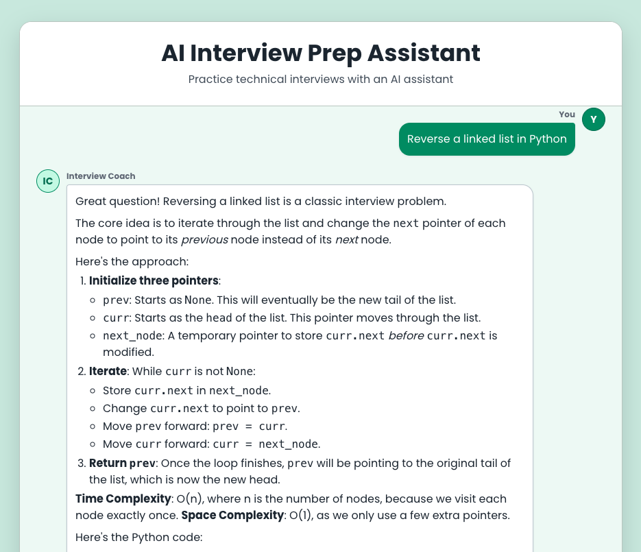

# AI Interview Prep Assistant

A full-stack chatbot that helps software engineering candidates practice for technical interviews. Built with Next.js and Google Gemini, it uses a retrieval-augmented generation (RAG) pipeline over a Pinecone vector database to ground its answers.

I built this as a computer science student because I wanted a useful way to practice for my own technical interviews, where I could ask follow-up questions and get real answers instead of a static list of problems.

**Live demo:** https://customer-support-ai-project.vercel.app/



## Features
- Conversational chat UI with answers that stream in token by token
- RAG pipeline: a knowledge base is chunked, embedded, and stored in Pinecone, and the closest matches are pulled into each prompt so answers stay grounded
- Code in answers is shown in syntax-highlighted blocks with a copy button
- Retry handling for model-overload (503) responses

## Tech stack
- Next.js (App Router) and React
- Google Gemini API (`@google/generative-ai`)
- LangChain and Pinecone for embeddings and vector search
- MUI for the interface

## Running locally
1. Install dependencies:
   ```bash
   npm install
   ```
2. Create a `.env.local` file with your keys:
   ```
   GOOGLE_STUDIO_API_KEY=your_gemini_key
   PINECONE_API_KEY=your_pinecone_key
   PINECONE_INDEX=your_index_name
   NEXT_PUBLIC_API_URL=http://localhost:3000
   ```
3. Start the dev server:
   ```bash
   npm run dev
   ```
4. With the server running, load the knowledge base into Pinecone with a one-time POST to `/api/scrape`:
   ```bash
   curl -X POST http://localhost:3000/api/scrape
   ```
5. Open http://localhost:3000 in your browser.
